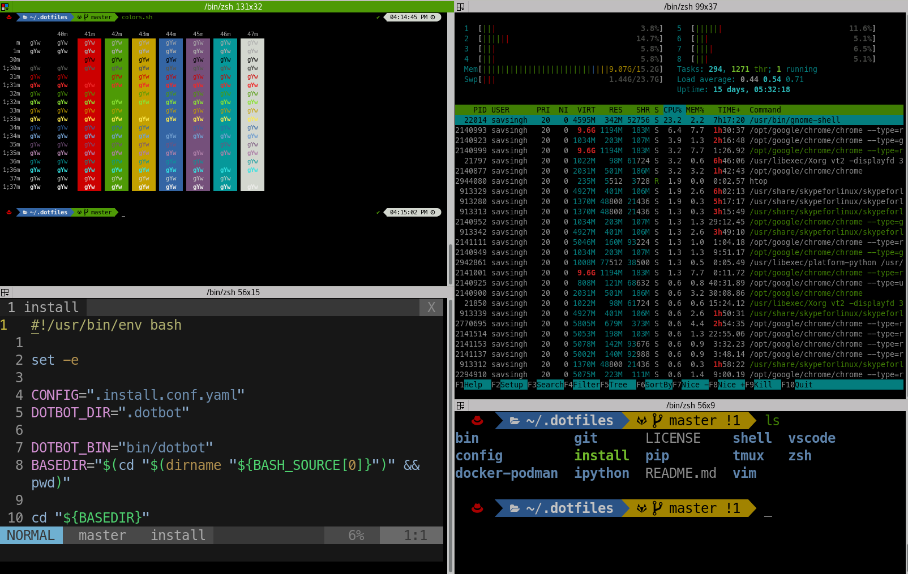

<div align="center">
    
    <br/>
    <br/>
    
    
    <br/>
    <h1>Savitoj's Dotfiles</h1>
    <p>These dotfiles are used to transform a system, into the code-ready environment with a couple of commands.
    These are my collection of dot files, based upon [dotbot](https://github.com/anishathalye/dotbot). You may consider initilizing your dotfiles using [init-dotfiles](https://github.com/Vaelatern/init-dotfiles) script.
    </p>
    :vertical_traffic_light: Using these will not break any dotfiles until forced but not suggested.
</div>

- [vim](https://github.com/vim/vim)
  - Consider [The Ultimate vimrc](https://github.com/amix/vimrc)
- [zsh](http://www.zsh.org/)
  - Consider [oh-my-zsh](https://github.com/robbyrussell/oh-my-zsh)
  - ZSH Plugins



How to Test dotfiles
--------------------

You can use `podman` or `docker` to test these dotfiles, everything can not be tested using `docker`/`podman`. Scripts are available in `podman-docker` directory

1. Build docker/podman image for local test
  ```bash
  cd docker-podman
  ./build-image
  ```
2. Run container to test dotfiles (run inside docker-podman directory)
  ```bash
  ./check_dotfiles bash
  ```
3. Install dotfiles
  ```bash
  cd /mnt && \
  git submodule update --init --recursive && \
  ./install
  ```
4. Run ZSH
  ```bash
  zsh
  ```
5. Customize your prompt if needed.
  ```bash
  p10k configure
  ```

Install
-------

Clone the repo and its submodules, then install links.
The install **will not** override any configs by default.

```bash
git clone https://github.com/savitojs/dotfiles.git ~/.dotfiles && \
cd ~/.dotfiles && \
./install
```

If errors occur due to existing files, move them and try again.

Update
------

Pull the latest from git and re-run the installer:

```bash
dfu # alias to update/pull changes to dotfiles
```

if alias doesn't work:

```bash
cd ~/.dotfiles && \
git pull --ff-only && \
./install -q
```
